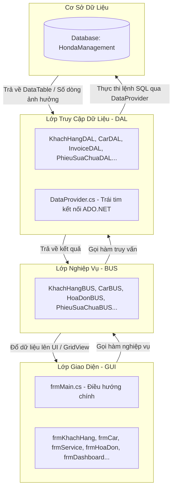

# HƯỚNG DẪN ĐỌC CODE & HIỂU LUỒNG XỬ LÝ (PROJECT QLCHHONDA)

Chào mừng các thành viên phát triển dự án **Hệ thống Quản lý Cửa hàng Xe máy Honda (QLCHHONDA)**. Tài liệu này được biên soạn nhằm giúp các bạn nhanh chóng nắm bắt cấu trúc source code, cách thức vận hành của hệ thống và luồng dữ liệu giữa các lớp để thực hiện các nhiệm vụ được giao một cách hiệu quả và thống nhất.

---

## 🛠 1. Tổng Quan Công Nghệ & Kiến Trúc
*   **Target Framework**: `.NET 10.0-windows` (Windows Forms hiện đại).
*   **Hệ quản trị CSDL**: SQL Server / SQL LocalDB.
*   **Thư viện kết nối**: `Microsoft.Data.SqlClient` (thay thế cho `System.Data.SqlClient` cũ để bảo mật và hiệu năng cao hơn).
*   **Kiến trúc hệ thống**: Áp dụng mô hình **3-Tier Architecture (Kiến trúc 3 lớp)** chuẩn hóa:



---

## 📂 2. Cấu Trúc Thư Mục Chi Tiết
Khi mở thư mục dự án `/honda`, bạn sẽ thấy các thư mục chính sau:

*   📂 **`GUI/` (Graphical User Interface)**: Chứa các Form giao diện (`.cs`, `.Designer.cs` và `.resx`).
    *   *Quy tắc responsive*: Tất cả các Form con đều được cấu hình kéo giãn linh hoạt (`Anchor = Top | Bottom | Left | Right`) để khi phóng to/nhỏ màn hình, giao diện tự động co giãn đẹp mắt, không bị chồng chéo hay mất chữ. Font chữ chuẩn hóa là **Segoe UI, 11pt**.
*   📂 **`BUS/` (Business Logic Layer)**: Nơi xử lý toàn bộ logic nghiệp vụ (kiểm tra tính hợp lệ của số điện thoại, định dạng CCCD, tính toán tiền bạc, phân quyền...).
*   📂 **`DAL/` (Data Access Layer)**: Nơi viết các câu truy vấn SQL (SELECT, INSERT, UPDATE, DELETE) tương tác trực tiếp với Database.
*   📂 **`Database/`**: Chứa file [Script.sql](file:///Users/turrets/Downloads/honda/honda/Database/Script.sql) để tạo toàn bộ cấu trúc bảng và dữ liệu mẫu.

---

## 🌊 3. Luồng Xử Lý Chi Tiết (Ví dụ: Thêm Khách Hàng Mới)
Để hiểu rõ cách dữ liệu di chuyển qua 3 lớp, hãy theo dõi luồng xử lý của chức năng **Thêm khách hàng**:

### Bước 1: Kích hoạt từ Giao diện (GUI)
Tại [frmKhachHang.cs](file:///Users/turrets/Downloads/honda/honda/GUI/frmKhachHang.cs), khi người dùng nhập thông tin và click nút **Thêm**, sự kiện `btnInsert_Click` được kích hoạt:
*   Thu thập dữ liệu từ các TextBox: `txtTenKH.Text`, `txtSDT.Text`, `txtDiaChi.Text`, `txtCCCD.Text`.
*   Gọi xuống lớp nghiệp vụ thông qua **Singleton** của BUS:
    ```csharp
    bool result = KhachHangBUS.Instance.AddKhachHang(tenKH, sdt, diaChi, cccd);
    ```
*   Nếu `result` trả về `true`, hiển thị thông báo thành công và load lại bảng dữ liệu.

### Bước 2: Kiểm tra Nghiệp vụ & Validate (BUS)
Tại [KhachHangBUS.cs](file:///Users/turrets/Downloads/honda/honda/BUS/KhachHangBUS.cs), nghiệp vụ sẽ được kiểm tra nghiêm ngặt trước khi gửi đến Database:
```csharp
public bool AddKhachHang(string tenKH, string sdt, string diaChi, string cccd)
{
    // 1. Kiểm tra không được để trống tên
    if (string.IsNullOrWhiteSpace(tenKH)) return false;

    // 2. Validate định dạng Số điện thoại (phải bắt đầu bằng số 0 và đủ 10 chữ số)
    if (!System.Text.RegularExpressions.Regex.IsMatch(sdt, @"^0\d{9}$")) return false;

    // 3. Kiểm tra số điện thoại đã tồn tại trong CSDL chưa
    if (IsSDTExists(sdt, -1)) {
        // Có thể ném exception hoặc thông báo trùng lặp
        return false; 
    }

    // 4. Nếu hợp lệ, gọi xuống lớp DAL
    return KhachHangDAL.Instance.AddKhachHang(tenKH.Trim(), sdt.Trim(), diaChi.Trim(), cccd.Trim());
}
```

### Bước 3: Thực thi truy vấn SQL (DAL)
Tại [KhachHangDAL.cs](file:///Users/turrets/Downloads/honda/honda/DAL/KhachHangDAL.cs), câu lệnh SQL được định nghĩa sử dụng **Parameters** để chống tấn công **SQL Injection**:
```csharp
public bool AddKhachHang(string tenKH, string sdt, string diaChi, string cccd)
{
    string query = "INSERT INTO KhachHang (TenKH, SDT, DiaChi, CCCD) VALUES ( @tenKH , @sdt , @diaChi , @cccd )";
    
    // Thực thi qua DataProvider và nhận về số lượng dòng bị ảnh hưởng (rows affected)
    int rows = DataProvider.Instance.ExecuteNonQuery(query, new object[] { tenKH, sdt, diaChi, cccd });
    return rows > 0;
}
```

### Bước 4: Trợ lý Kết nối CSDL (DataProvider)
[DataProvider.cs](file:///Users/turrets/Downloads/honda/honda/DAL/DataProvider.cs) là lớp dùng chung, đảm nhận việc mở kết nối, tự động phân tích tham số `@tenKH`, `@sdt`,... khớp với mảng `object[]` truyền vào, thực thi lệnh và đóng kết nối an toàn để tránh rò rỉ bộ nhớ (connection leaks).

---
## 🎯 4. Phân Công Nhiệm Vụ & Hướng Dẫn Đọc Code Cho Từng Thành Viên

Để dự án chạy đúng tiến độ và không bị giẫm chân lên nhau, nhóm mình sẽ chia vai trò cụ thể như bảng dưới đây. Các bạn hãy tìm đúng tên/vai trò của mình để xem hướng dẫn chi tiết nhé:

### 📊 Bảng Phân Công Vai Trò Tổng Quan

| Thành Viên | Vai Trò / Vị Trí | Nhiệm Vụ Chi Tiết | Các File Chính Cần Phụ Trách & Đọc |
| :--- | :--- | :--- | :--- |
| **Thành viên 1**<br>*(Nhóm trưởng)* | **Cấu hình & Tích hợp hệ thống**<br>(System & Integration) | - Khởi tạo repo Git, quản lý nhánh.<br>- Quản lý lớp lõi kết nối CSDL `DataProvider.cs`.<br>- Phân quyền bảo mật (Admin/Staff), điều hướng chính và đăng nhập hệ thống. | - [DataProvider.cs](file:///Users/turrets/Downloads/honda/honda/DAL/DataProvider.cs)<br>- [frmMain.cs](file:///Users/turrets/Downloads/honda/honda/GUI/frmMain.cs)<br>- [frmLogin.cs](file:///Users/turrets/Downloads/honda/honda/GUI/frmLogin.cs)<br>- `AccountBUS.cs` / `AccountDAL.cs` |
| **Thành viên 2** | **Thiết kế UI/UX & Giao Diện**<br>(Front-End Developer) | - Thiết kế giao diện phẳng, đẹp mắt.<br>- Cấu hình responsive cho tất cả các Form (co giãn tự động không lệch dòng).<br>- Chuẩn hóa font chữ Segoe UI 11F, bắt sự kiện click và hiển thị trên UI. | - Các file `*.Designer.cs` trong `GUI/`<br>- Các file `*.cs` trong `GUI/` (xử lý hiển thị GridView, ComboBox, Textbox...) |
| **Thành viên 3** | **Xử lý Nghiệp vụ & Tính toán**<br>(Business Logic Developer) | - Viết toàn bộ hàm kiểm tra dữ liệu đầu vào (Regex kiểm tra SĐT, CCCD).<br>- Viết logic kiểm tra tồn kho trước khi bán, tính toán hóa đơn.<br>- Định dạng dữ liệu trước khi gửi xuống lớp DAL. | - Toàn bộ các lớp trong thư mục `BUS/`<br>- (Ví dụ: `KhachHangBUS.cs`, `CarBUS.cs`, `HoaDonBUS.cs`...) |
| **Thành viên 4** | **Truy vấn SQL & Cơ sở dữ liệu**<br>(Database Developer) | - Quản lý file [Script.sql](file:///Users/turrets/Downloads/honda/honda/Database/Script.sql).<br>- Viết các câu lệnh SQL tương tác bảng.<br>- Đảm bảo viết câu lệnh SQL có tham số (Parameters) chống tấn công SQL Injection. | - [Script.sql](file:///Users/turrets/Downloads/honda/honda/Database/Script.sql)<br>- Toàn bộ các lớp trong thư mục `DAL/`<br>- (Ví dụ: `KhachHangDAL.cs`, `CarDAL.cs`, `InvoiceDAL.cs`...) |

---

### 👨‍💻 Hướng Dẫn Đọc Code Chi Tiết Cho Từng Thành Viên:

#### 👑 1. Dành cho Thành viên 1 (Nhóm trưởng / System Architecture)
*   **Mục tiêu**: Quản lý luồng đăng nhập, phân quyền truy cập chức năng cho Nhân viên bán hàng và Admin, kết nối cơ sở dữ liệu dùng chung.
*   **Chi tiết file cần đọc**:
    *   [frmLogin.cs](file:///Users/turrets/Downloads/honda/honda/GUI/frmLogin.cs) & [frmMain.cs](file:///Users/turrets/Downloads/honda/honda/GUI/frmMain.cs): Đọc để hiểu cách truyền tham số `userRole` và `username` từ Form Login sang Form Main.
    *   Hàm `ApplyPermissions()` trong [frmMain.cs](file:///Users/turrets/Downloads/honda/honda/GUI/frmMain.cs): Xem cách ẩn/hiện các nút menu của `Staff` (Nhân viên không được xem Thống kê và Kho xe).
    *   [DataProvider.cs](file:///Users/turrets/Downloads/honda/honda/DAL/DataProvider.cs): Nơi khởi tạo chuỗi kết nối và các phương thức thực thi SQL cơ bản.

#### 🎨 2. Dành cho Thành viên 2 (Front-End / UI Developer)
*   **Mục tiêu**: Đảm bảo giao diện đồng bộ, hiển thị mượt mà và co giãn hoàn hảo (responsive layout) khi người dùng phóng to/nhỏ cửa sổ.
*   **Chi tiết file cần đọc**:
    *   Tập trung xem cách kéo thả và cài đặt thuộc tính trực tiếp trong file `.Designer.cs` (Ví dụ: [frmCar.Designer.cs](file:///Users/turrets/Downloads/honda/honda/GUI/frmCar.Designer.cs), [frmService.Designer.cs](file:///Users/turrets/Downloads/honda/honda/GUI/frmService.Designer.cs)).
*   **Bí kíp thiết kế**:
    *   **Không bao giờ cố định kích thước**: Luôn sử dụng thuộc tính `Anchor` (Neo vào cạnh trên, dưới, trái, phải) hoặc `Dock = Fill` để điều khiển sự co giãn của lưới dữ liệu (`DataGridView`), các nút bấm (`Button`), và khung nhập dữ liệu (`GroupBox`).
    *   Bắt các sự kiện hiển thị trên UI: Ví dụ khi chọn 1 dòng trên GridView (`CellClick`) thì tự động đổ thông tin ngược lên các TextBox tương ứng trên giao diện (Đọc hàm `dgv_CellClick` trong các Form).

#### 🧠 3. Dành cho Thành viên 3 (Middle-Tier / BUS Developer)
*   **Mục tiêu**: Kiểm soát toàn bộ các quy tắc nghiệp vụ, tính hợp lệ của dữ liệu trước khi gửi xuống cơ sở dữ liệu.
*   **Chi tiết file cần đọc**:
    *   Toàn bộ thư mục `BUS/`. Tham khảo mẫu tại [KhachHangBUS.cs](file:///Users/turrets/Downloads/honda/honda/BUS/KhachHangBUS.cs).
*   **Bí kíp xử lý**:
    *   Khi viết nghiệp vụ cho chức năng Thêm/Sửa: Phải thực hiện kiểm tra dữ liệu trống (`string.IsNullOrWhiteSpace`), kiểm tra định dạng đặc biệt (Số điện thoại bắt buộc bắt đầu bằng `0` và đủ `10` chữ số: `Regex.IsMatch(sdt, @"^0\d{9}$")`).
    *   Xử lý logic nghiệp vụ nâng cao: Ví dụ kiểm tra xem số lượng xe máy còn trong kho không trước khi lập hóa đơn bán xe.

#### 💾 4. Dành cho Thành viên 4 (Back-End / Database Developer)
*   **Mục tiêu**: Viết các câu lệnh truy vấn dữ liệu nhanh chóng, chính xác và an toàn tuyệt đối.
*   **Chi tiết file cần đọc**:
    *   Toàn bộ các file trong thư mục `DAL/` (Ví dụ: `CarDAL.cs`, `InvoiceDAL.cs`).
*   **Bí kíp viết SQL**:
    *   **Bảo mật tuyệt đối**: Tất cả các hàm truy vấn có tham số động từ người dùng nhập vào bắt buộc phải truyền qua mảng tham số của `DataProvider` thay vì cộng chuỗi trực tiếp.
    *   *Mẫu đúng chuẩn chống SQL Injection*:
        ```csharp
        string query = "SELECT * FROM KhachHang WHERE TenKH LIKE @ten";
        return DataProvider.Instance.ExecuteQuery(query, new object[] { "%" + keyword + "%" });
        ```
    *   Cần phối hợp chặt chẽ với Thành viên 3 (BUS) để biết cấu trúc tham số cần truyền và Thành viên 2 (UI) để biết các trường thông tin cần trả về hiển thị trên lưới.

---
---

## 💎 5. Các Quy Ước Lập Trình Quan Trọng (Coding Conventions)

Để code của cả nhóm không bị xung đột và giữ được sự sạch đẹp, hãy tuân thủ các quy ước sau:

1.  **Singleton Pattern**: Tất cả các lớp BUS và DAL đều phải được triển khai theo dạng Singleton để tiết kiệm bộ nhớ và dễ quản lý.
    *   *Cách gọi*: `TenLopBUS.Instance.TenHam()` thay vì tạo mới `new TenLopBUS()`.
2.  **Chuỗi kết nối di động**:
    *   Chuỗi kết nối mặc định trong dự án đã được cấu hình thành `Server=(localdb)\MSSQLLocalDB` để chạy tự động trên tất cả các máy tính có cài LocalDB.
    *   **Không commit chuỗi kết nối cá nhân dạng pipe động (`np:\\.\pipe\...`)** lên GitHub.
3.  **Tên Biến & Tên Hàm**:
    *   Tên hàm/Phương thức: Viết hoa chữ cái đầu (PascalCase) -> Ví dụ: `GetAllKhachHang()`, `ExecuteQuery()`.
    *   Tên biến cục bộ/Tham số: Viết thường chữ cái đầu (camelCase) -> Ví dụ: `tenKH`, `connectionString`.
4.  **Xử lý dữ liệu Null**:
    *   Dự án đã kích hoạt tính năng `<Nullable>enable</Nullable>` trong file cấu hình `.csproj`. Hãy chú ý dùng toán tử check null (`?` hoặc `??`) để tránh lỗi `NullReferenceException` khi chạy chương trình.

---

## 📈 6. Hướng Dẫn Nhanh Cách Setup & Run

Khi một thành viên mới clone dự án về, chỉ cần hướng dẫn họ thực hiện 3 bước sau:

1.  **Khởi tạo Database**:
    *   Mở SQL Server Management Studio (SSMS) hoặc Visual Studio.
    *   Mở file [Script.sql](file:///Users/turrets/Downloads/honda/honda/Database/Script.sql) và chạy (**Execute**) để sinh database `HondaManagement` cùng các bảng và dữ liệu mẫu.
2.  **Mở Project**:
    *   Mở file `honda.slnx` bằng Visual Studio.
3.  **Kiểm tra & Cấu hình chuỗi kết nối trong DataProvider.cs**:
    Mở file [DataProvider.cs](file:///Users/turrets/Downloads/honda/honda/DAL/DataProvider.cs), tìm dòng 16 và điều chỉnh thuộc tính `connectionString` sao cho phù hợp với loại SQL Server cài trên máy của bạn:

    *   **Trường hợp 1: Sử dụng SQL Server LocalDB (Mặc định trong dự án - Khuyên dùng vì siêu nhẹ)**
        ```csharp
        private readonly string connectionString = @"Server=(localdb)\MSSQLLocalDB;Database=HondaManagement;Trusted_Connection=True;TrustServerCertificate=True;";
        ```
    *   **Trường hợp 2: Sử dụng SQL Server Express (Bản cài đặt miễn phí phổ biến của Microsoft)**
        ```csharp
        private readonly string connectionString = @"Server=.\SQLEXPRESS;Database=HondaManagement;Trusted_Connection=True;TrustServerCertificate=True;";
        ```
    *   **Trường hợp 3: Sử dụng SQL Server Standard / Developer (Bản đầy đủ, kết nối qua localhost)**
        ```csharp
        private readonly string connectionString = @"Server=localhost;Database=HondaManagement;Trusted_Connection=True;TrustServerCertificate=True;";
        // Hoặc dùng dấu chấm đại diện cho local:
        // private readonly string connectionString = @"Server=.;Database=HondaManagement;Trusted_Connection=True;TrustServerCertificate=True;";
        ```
    *   **Trường hợp 4: Kết nối bằng tài khoản SQL Server Authentication (Dùng Username và Password ví dụ `sa`)**
        ```csharp
        private readonly string connectionString = @"Server=localhost;Database=HondaManagement;User Id=sa;Password=Mật_Khẩu_Của_Bạn;TrustServerCertificate=True;";
        ```

    ⚠️ **Lưu ý cực kỳ quan trọng**:
    *   **Lỗi 26 / Lỗi Instance**: Nếu chạy app bị báo lỗi kết nối database, 99% là do tên Server (`Server=...`) chưa khớp với tên instance SQL Server đang chạy trên máy của bạn. Hãy mở SSMS xem tên server của bạn là gì rồi copy dán vào nhé!
    *   Thuộc tính `TrustServerCertificate=True;` là bắt buộc phải có để tránh lỗi SSL/TLS handshake trên các bản .NET mới.

4.  **Tài khoản đăng nhập mẫu**:
    *   **Admin**: tài khoản `admin` / mật khẩu `admin` (hoặc `1`).
    *   **Staff**: tài khoản `staff` / mật khẩu `1`.

---
*Chúc cả nhóm hợp tác vui vẻ và hoàn thành xuất sắc nhiệm vụ! Nếu có bất kỳ câu hỏi nào về luồng code, hãy liên hệ trực tiếp với Leader.*
