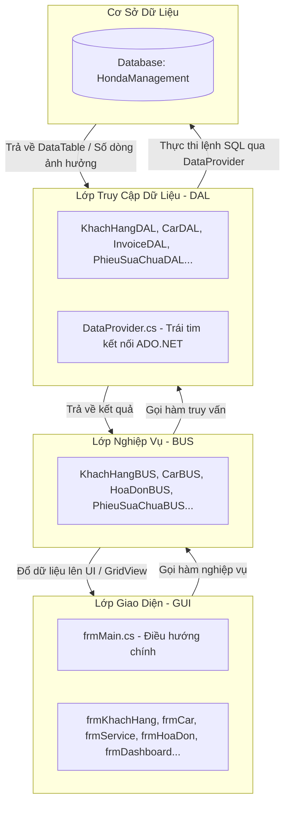

# HƯỚNG DẪN ĐỌC CODE & HIỂU LUỒNG XỬ LÝ (PROJECT QLCHHONDA)

Chào mừng các thành viên phát triển dự án **Hệ thống Quản lý Cửa hàng Xe máy Honda (QLCHHONDA)**. Tài liệu này được biên soạn nhằm giúp các bạn nhanh chóng nắm bắt cấu trúc source code, cách thức vận hành của hệ thống và luồng dữ liệu giữa các lớp để thực hiện các nhiệm vụ được giao một cách hiệu quả và thống nhất.

---

## 🛠 1. Tổng Quan Công Nghệ & Kiến Trúc
*   **Target Framework**: `.NET 10.0-windows` (Windows Forms hiện đại).
*   **Hệ quản trị CSDL**: SQL Server / SQL LocalDB.
*   **Thư viện kết nối**: `Microsoft.Data.SqlClient` (thay thế cho `System.Data.SqlClient` cũ để bảo mật và hiệu năng cao hơn).
*   **Kiến trúc hệ thống**: Áp dụng mô hình **3-Tier Architecture (Kiến trúc 3 lớp)** chuẩn hóa:



---

## 📂 2. Cấu Trúc Thư Mục Chi Tiết
Khi mở thư mục dự án `/honda`, bạn sẽ thấy các thư mục chính sau:

*   📂 **`GUI/` (Graphical User Interface)**: Chứa các Form giao diện (`.cs`, `.Designer.cs` và `.resx`).
    *   *Quy tắc responsive*: Tất cả các Form con đều được cấu hình kéo giãn linh hoạt (`Anchor = Top | Bottom | Left | Right`) để khi phóng to/nhỏ màn hình, giao diện tự động co giãn đẹp mắt, không bị chồng chéo hay mất chữ. Font chữ chuẩn hóa là **Segoe UI, 11pt**.
*   📂 **`BUS/` (Business Logic Layer)**: Nơi xử lý toàn bộ logic nghiệp vụ (kiểm tra tính hợp lệ của số điện thoại, định dạng CCCD, tính toán tiền bạc, phân quyền...).
*   📂 **`DAL/` (Data Access Layer)**: Nơi viết các câu truy vấn SQL (SELECT, INSERT, UPDATE, DELETE) tương tác trực tiếp với Database.
*   📂 **`Database/`**: Chứa file [Script.sql](file:///Users/turrets/Downloads/honda/honda/Database/Script.sql) để tạo toàn bộ cấu trúc bảng và dữ liệu mẫu.

---

## 🌊 3. Luồng Xử Lý Chi Tiết (Ví dụ: Thêm Khách Hàng Mới)
Để hiểu rõ cách dữ liệu di chuyển qua 3 lớp, hãy theo dõi luồng xử lý của chức năng **Thêm khách hàng**:

### Bước 1: Kích hoạt từ Giao diện (GUI)
Tại [frmKhachHang.cs](file:///Users/turrets/Downloads/honda/honda/GUI/frmKhachHang.cs), khi người dùng nhập thông tin và click nút **Thêm**, sự kiện `btnInsert_Click` được kích hoạt:
*   Thu thập dữ liệu từ các TextBox: `txtTenKH.Text`, `txtSDT.Text`, `txtDiaChi.Text`, `txtCCCD.Text`.
*   Gọi xuống lớp nghiệp vụ thông qua **Singleton** của BUS:
    ```csharp
    bool result = KhachHangBUS.Instance.AddKhachHang(tenKH, sdt, diaChi, cccd);
    ```
*   Nếu `result` trả về `true`, hiển thị thông báo thành công và load lại bảng dữ liệu.

### Bước 2: Kiểm tra Nghiệp vụ & Validate (BUS)
Tại [KhachHangBUS.cs](file:///Users/turrets/Downloads/honda/honda/BUS/KhachHangBUS.cs), nghiệp vụ sẽ được kiểm tra nghiêm ngặt trước khi gửi đến Database:
```csharp
public bool AddKhachHang(string tenKH, string sdt, string diaChi, string cccd)
{
    // 1. Kiểm tra không được để trống tên
    if (string.IsNullOrWhiteSpace(tenKH)) return false;

    // 2. Validate định dạng Số điện thoại (phải bắt đầu bằng số 0 và đủ 10 chữ số)
    if (!System.Text.RegularExpressions.Regex.IsMatch(sdt, @"^0\d{9}$")) return false;

    // 3. Kiểm tra số điện thoại đã tồn tại trong CSDL chưa
    if (IsSDTExists(sdt, -1)) {
        // Có thể ném exception hoặc thông báo trùng lặp
        return false; 
    }

    // 4. Nếu hợp lệ, gọi xuống lớp DAL
    return KhachHangDAL.Instance.AddKhachHang(tenKH.Trim(), sdt.Trim(), diaChi.Trim(), cccd.Trim());
}
```

### Bước 3: Thực thi truy vấn SQL (DAL)
Tại [KhachHangDAL.cs](file:///Users/turrets/Downloads/honda/honda/DAL/KhachHangDAL.cs), câu lệnh SQL được định nghĩa sử dụng **Parameters** để chống tấn công **SQL Injection**:
```csharp
public bool AddKhachHang(string tenKH, string sdt, string diaChi, string cccd)
{
    string query = "INSERT INTO KhachHang (TenKH, SDT, DiaChi, CCCD) VALUES ( @tenKH , @sdt , @diaChi , @cccd )";
    
    // Thực thi qua DataProvider và nhận về số lượng dòng bị ảnh hưởng (rows affected)
    int rows = DataProvider.Instance.ExecuteNonQuery(query, new object[] { tenKH, sdt, diaChi, cccd });
    return rows > 0;
}
```

### Bước 4: Trợ lý Kết nối CSDL (DataProvider)
[DataProvider.cs](file:///Users/turrets/Downloads/honda/honda/DAL/DataProvider.cs) là lớp dùng chung, đảm nhận việc mở kết nối, tự động phân tích tham số `@tenKH`, `@sdt`,... khớp với mảng `object[]` truyền vào, thực thi lệnh và đóng kết nối an toàn để tránh rò rỉ bộ nhớ (connection leaks).

---
## 🎯 4. Phân Công Nhiệm Vụ & Hướng Dẫn Đọc Code Cho Từng Thành Viên

Để dự án chạy đúng tiến độ và không bị giẫm chân lên nhau, nhóm mình đã thống nhất chia vai trò chi tiết như bảng dưới đây. Các bạn hãy tìm đúng tên của mình để xem hướng dẫn và các file cần phụ trách nhé:

### 📊 Bảng Phân Công Nhiệm Vụ Thành Viên

| Thành Viên | Chức Năng (Module) | Nhiệm Vụ Chi Tiết | Các File Cần Đọc & Phụ Trách |
| :--- | :--- | :--- | :--- |
| **Trường** | **Thống kê & Đăng nhập** & **Bảo dưỡng & Dịch vụ** | - Thiết kế Form Login, Form Main (Menu điều hướng phân quyền Staff/Admin).<br>- Viết truy vấn thống kê doanh thu/số lượng xe đã bán cho Dashboard.<br>- Thiết kế Form Phiếu sửa chữa: nhập biển số, nội dung bảo dưỡng, quản lý phụ tùng dịch vụ. | **GUI:**<br>- [frmLogin.cs](file:///Users/turrets/Downloads/honda/honda/GUI/frmLogin.cs)<br>- [frmMain.cs](file:///Users/turrets/Downloads/honda/honda/GUI/frmMain.cs)<br>- [frmDashboard.cs](file:///Users/turrets/Downloads/honda/honda/GUI/frmDashboard.cs)<br>- [frmService.cs](file:///Users/turrets/Downloads/honda/honda/GUI/frmService.cs)<br>**BUS & DAL:**<br>- `AccountBUS.cs` / `AccountDAL.cs`<br>- `DashboardBUS.cs` / `DataProvider.cs`<br>- `PhieuSuaChuaBUS.cs` / `PhieuSuaChuaDAL.cs`<br>- `PhuTungBUS.cs` / `PhuTungDAL.cs` |
| **Ninh** | **Quản lý Kho Xe** | - Thiết kế Form nhập thông tin xe: Tên xe, dòng xe, số khung, số máy, giá nhập, màu sắc.<br>- Đổ danh sách xe máy lên DataGridView và thực hiện CRUD. | **GUI:**<br>- [frmCar.cs](file:///Users/turrets/Downloads/honda/honda/GUI/frmCar.cs)<br>- [frmCar.Designer.cs](file:///Users/turrets/Downloads/honda/honda/GUI/frmCar.Designer.cs)<br>**BUS & DAL:**<br>- `CarBUS.cs`<br>- `CarDAL.cs` |
| **Quân** | **Quản lý Khách hàng** | - Thiết kế Form lưu thông tin khách hàng: Họ tên, SĐT, địa chỉ, số CCCD.<br>- Tra cứu lịch sử khách hàng, kiểm tra hợp lệ dữ liệu. | **GUI:**<br>- [frmKhachHang.cs](file:///Users/turrets/Downloads/honda/honda/GUI/frmKhachHang.cs)<br>- [frmKhachHang.Designer.cs](file:///Users/turrets/Downloads/honda/honda/GUI/frmKhachHang.Designer.cs)<br>**BUS & DAL:**<br>- `KhachHangBUS.cs`<br>- `KhachHangDAL.cs` |
| **Khoa** | **Bán hàng (Hóa đơn)** | - Thiết kế Form lập hóa đơn bán xe: Chọn xe + Chọn khách hàng -> Tính toán thành tiền, thuế VAT, phí trước bạ.<br>- Lưu trữ và xuất hóa đơn. | **GUI:**<br>- [frmHoaDon.cs](file:///Users/turrets/Downloads/honda/honda/GUI/frmHoaDon.cs)<br>- [frmHoaDon.Designer.cs](file:///Users/turrets/Downloads/honda/honda/GUI/frmHoaDon.Designer.cs)<br>**BUS & DAL:**<br>- `HoaDonBUS.cs`<br>- `InvoiceDAL.cs` |

---

### 👨‍💻 Hướng Dẫn Đọc Code Chi Tiết Cho Từng Bạn:

#### 👑 1. Hướng dẫn dành riêng cho bạn **Trường**
*   **Module phụ trách**: *Thống kê & Đăng nhập* + *Bảo dưỡng & Dịch vụ*
*   **Bí kíp đọc và phát triển**:
    *   **Phần Đăng nhập & Main**: Xem cách `frmMain.cs` nhận vai trò (`role`) và tên tài khoản từ `frmLogin.cs`. Đọc hàm `ApplyPermissions()` trong `frmMain.cs` để hiểu cơ chế ẩn Menu Thống kê và Kho xe khi tài khoản đăng nhập là nhân viên bán hàng (`Staff`).
    *   **Phần Thống kê (Dashboard)**: Đọc cách `frmDashboard.cs` gọi lớp `DashboardBUS` để lấy tổng doanh thu, tổng số khách hàng, tổng xe bán và hiển thị biểu đồ qua `System.Windows.Forms.DataVisualization`.
    *   **Phần Bảo dưỡng & Dịch vụ**: Đọc [frmService.cs](file:///Users/turrets/Downloads/honda/honda/GUI/frmService.cs) để hiểu luồng tạo phiếu sửa chữa, gán phụ tùng thay thế và tính tổng chi phí dịch vụ cho khách.

#### 🏍️ 2. Hướng dẫn dành riêng cho bạn **Ninh**
*   **Module phụ trách**: *Quản lý Kho Xe*
*   **Bí kíp đọc và phát triển**:
    *   **Giao diện**: Đọc file [frmCar.Designer.cs](file:///Users/turrets/Downloads/honda/honda/GUI/frmCar.Designer.cs) để xem cách bố trí các ô nhập liệu (Tên xe, số máy, số khung, màu sắc...).
    *   **Lưu ý co giãn**: Khi mở form full màn hình, GridView chứa xe phải tự động dãn rộng. Đảm bảo thuộc tính `Anchor` của DataGridView được đặt là `Top | Bottom | Left | Right`.
    *   **Nghiệp vụ**: Xem `CarBUS.cs` để hiểu cách kiểm tra giá nhập không được âm trước khi thêm xe. Xem `CarDAL.cs` để xem cách viết câu lệnh INSERT/UPDATE thông tin xe máy an toàn.

#### 👥 3. Hướng dẫn dành riêng cho bạn **Quân**
*   **Module phụ trách**: *Quản lý Khách hàng*
*   **Bí kíp đọc và phát triển**:
    *   **Giao diện**: Đọc file [frmKhachHang.cs](file:///Users/turrets/Downloads/honda/honda/GUI/frmKhachHang.cs) để xem các trường: Tên, SĐT, Địa chỉ, CCCD.
    *   **Xử lý Logic**: Đọc file [KhachHangBUS.cs](file:///Users/turrets/Downloads/honda/honda/BUS/KhachHangBUS.cs) để thấy cách validate Số điện thoại (phải bắt đầu bằng `0`, đủ `10` số) và số CCCD (đủ `12` số) bằng Regex. Bạn Quân cần phối hợp với bạn Khoa để khi bán hàng, bạn Khoa có thể dễ dàng chọn khách hàng đã lưu trong database của bạn Quân.

#### 🧾 4. Hướng dẫn dành riêng cho bạn **Khoa**
*   **Module phụ trách**: *Bán hàng (Hóa đơn)*
*   **Bí kíp đọc và phát triển**:
    *   **Luồng xử lý hóa đơn**: Khi lập hóa đơn bán xe, bạn Khoa cần chọn Khách hàng (lấy từ dữ liệu của Quân) và chọn Xe máy (lấy từ kho xe của Ninh).
    *   **Tính toán tiền**: Đọc [frmHoaDon.cs](file:///Users/turrets/Downloads/honda/honda/GUI/frmHoaDon.cs) để hiểu cách tính tổng tiền: `Thành tiền = Giá Xe + Thuế VAT (10%) + Phí trước bạ`.
    *   **Database**: Lớp `InvoiceDAL.cs` sẽ lưu dữ liệu xuống bảng `HoaDon` và bảng `ChiTietHoaDon`. Đọc file này để hiểu cách lưu thông tin giao dịch của khách hàng mua xe máy.

---
---

## 💎 5. Các Quy Ước Lập Trình Quan Trọng (Coding Conventions)

Để code của cả nhóm không bị xung đột và giữ được sự sạch đẹp, hãy tuân thủ các quy ước sau:

1.  **Singleton Pattern**: Tất cả các lớp BUS và DAL đều phải được triển khai theo dạng Singleton để tiết kiệm bộ nhớ và dễ quản lý.
    *   *Cách gọi*: `TenLopBUS.Instance.TenHam()` thay vì tạo mới `new TenLopBUS()`.
2.  **Chuỗi kết nối di động**:
    *   Chuỗi kết nối mặc định trong dự án đã được cấu hình thành `Server=(localdb)\MSSQLLocalDB` để chạy tự động trên tất cả các máy tính có cài LocalDB.
    *   **Không commit chuỗi kết nối cá nhân dạng pipe động (`np:\\.\pipe\...`)** lên GitHub.
3.  **Tên Biến & Tên Hàm**:
    *   Tên hàm/Phương thức: Viết hoa chữ cái đầu (PascalCase) -> Ví dụ: `GetAllKhachHang()`, `ExecuteQuery()`.
    *   Tên biến cục bộ/Tham số: Viết thường chữ cái đầu (camelCase) -> Ví dụ: `tenKH`, `connectionString`.
4.  **Xử lý dữ liệu Null**:
    *   Dự án đã kích hoạt tính năng `<Nullable>enable</Nullable>` trong file cấu hình `.csproj`. Hãy chú ý dùng toán tử check null (`?` hoặc `??`) để tránh lỗi `NullReferenceException` khi chạy chương trình.

---

## 📈 6. Hướng Dẫn Nhanh Cách Setup & Run

Khi một thành viên mới clone dự án về, chỉ cần hướng dẫn họ thực hiện 3 bước sau:

1.  **Khởi tạo Database**:
    *   Mở SQL Server Management Studio (SSMS) hoặc Visual Studio.
    *   Mở file [Script.sql](file:///Users/turrets/Downloads/honda/honda/Database/Script.sql) và chạy (**Execute**) để sinh database `HondaManagement` cùng các bảng và dữ liệu mẫu.
2.  **Mở Project**:
    *   Mở file `honda.slnx` bằng Visual Studio.
3.  **Kiểm tra & Cấu hình chuỗi kết nối trong DataProvider.cs**:
    Mở file [DataProvider.cs](file:///Users/turrets/Downloads/honda/honda/DAL/DataProvider.cs), tìm dòng 16 và điều chỉnh thuộc tính `connectionString` sao cho phù hợp với loại SQL Server cài trên máy của bạn:

    *   **Trường hợp 1: Sử dụng SQL Server LocalDB (Mặc định trong dự án - Khuyên dùng vì siêu nhẹ)**
        ```csharp
        private readonly string connectionString = @"Server=(localdb)\MSSQLLocalDB;Database=HondaManagement;Trusted_Connection=True;TrustServerCertificate=True;";
        ```
    *   **Trường hợp 2: Sử dụng SQL Server Express (Bản cài đặt miễn phí phổ biến của Microsoft)**
        ```csharp
        private readonly string connectionString = @"Server=.\SQLEXPRESS;Database=HondaManagement;Trusted_Connection=True;TrustServerCertificate=True;";
        ```
    *   **Trường hợp 3: Sử dụng SQL Server Standard / Developer (Bản đầy đủ, kết nối qua localhost)**
        ```csharp
        private readonly string connectionString = @"Server=localhost;Database=HondaManagement;Trusted_Connection=True;TrustServerCertificate=True;";
        // Hoặc dùng dấu chấm đại diện cho local:
        // private readonly string connectionString = @"Server=.;Database=HondaManagement;Trusted_Connection=True;TrustServerCertificate=True;";
        ```
    *   **Trường hợp 4: Kết nối bằng tài khoản SQL Server Authentication (Dùng Username và Password ví dụ `sa`)**
        ```csharp
        private readonly string connectionString = @"Server=localhost;Database=HondaManagement;User Id=sa;Password=Mật_Khẩu_Của_Bạn;TrustServerCertificate=True;";
        ```

    ⚠️ **Lưu ý cực kỳ quan trọng**:
    *   **Lỗi 26 / Lỗi Instance**: Nếu chạy app bị báo lỗi kết nối database, 99% là do tên Server (`Server=...`) chưa khớp với tên instance SQL Server đang chạy trên máy của bạn. Hãy mở SSMS xem tên server của bạn là gì rồi copy dán vào nhé!
    *   Thuộc tính `TrustServerCertificate=True;` là bắt buộc phải có để tránh lỗi SSL/TLS handshake trên các bản .NET mới.

4.  **Tài khoản đăng nhập mẫu**:
    *   **Admin**: tài khoản `admin` / mật khẩu `admin` (hoặc `123`).
    *   **Staff**: tài khoản `staff` / mật khẩu `123`.

---
*Chúc cả nhóm hợp tác vui vẻ và hoàn thành xuất sắc nhiệm vụ! Nếu có bất kỳ câu hỏi nào về luồng code, hãy liên hệ trực tiếp với Leader.*
