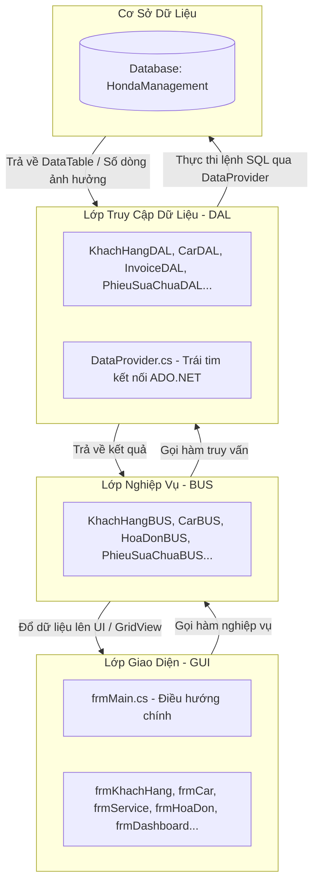

# HƯỚNG DẪN ĐỌC CODE & HIỂU LUỒNG XỬ LÝ (PROJECT QLCHHONDA)

Chào mừng các thành viên phát triển dự án **Hệ thống Quản lý Cửa hàng Xe máy Honda (QLCHHONDA)**. Tài liệu này được biên soạn nhằm giúp các bạn nhanh chóng nắm bắt cấu trúc source code, cách thức vận hành của hệ thống và luồng dữ liệu giữa các lớp để thực hiện các nhiệm vụ được giao một cách hiệu quả và thống nhất.

---

## 🛠 1. Tổng Quan Công Nghệ & Kiến Trúc
*   **Target Framework**: `.NET 10.0-windows` (Windows Forms hiện đại).
*   **Hệ quản trị CSDL**: SQL Server / SQL LocalDB.
*   **Thư viện kết nối**: `Microsoft.Data.SqlClient` (thay thế cho `System.Data.SqlClient` cũ để bảo mật và hiệu năng cao hơn).
*   **Kiến trúc hệ thống**: Áp dụng mô hình **3-Tier Architecture (Kiến trúc 3 lớp)** chuẩn hóa:



---

## 📂 2. Cấu Trúc Thư Mục Chi Tiết
Khi mở thư mục dự án `/honda`, bạn sẽ thấy các thư mục chính sau:

*   📂 **`GUI/` (Graphical User Interface)**: Chứa các Form giao diện (`.cs`, `.Designer.cs` và `.resx`).
    *   *Quy tắc responsive*: Tất cả các Form con đều được cấu hình kéo giãn linh hoạt (`Anchor = Top | Bottom | Left | Right`) để khi phóng to/nhỏ màn hình, giao diện tự động co giãn đẹp mắt, không bị chồng chéo hay mất chữ. Font chữ chuẩn hóa là **Segoe UI, 11pt**.
*   📂 **`BUS/` (Business Logic Layer)**: Nơi xử lý toàn bộ logic nghiệp vụ (kiểm tra tính hợp lệ của số điện thoại, định dạng CCCD, tính toán tiền bạc, phân quyền...).
*   📂 **`DAL/` (Data Access Layer)**: Nơi viết các câu truy vấn SQL (SELECT, INSERT, UPDATE, DELETE) tương tác trực tiếp với Database.
*   📂 **`Database/`**: Chứa file [Script.sql](file:///Users/turrets/Downloads/honda/honda/Database/Script.sql) để tạo toàn bộ cấu trúc bảng và dữ liệu mẫu.

---

## 🌊 3. Luồng Xử Lý Chi Tiết (Ví dụ: Thêm Khách Hàng Mới)
Để hiểu rõ cách dữ liệu di chuyển qua 3 lớp, hãy theo dõi luồng xử lý của chức năng **Thêm khách hàng**:

### Bước 1: Kích hoạt từ Giao diện (GUI)
Tại [frmKhachHang.cs](file:///Users/turrets/Downloads/honda/honda/GUI/frmKhachHang.cs), khi người dùng nhập thông tin và click nút **Thêm**, sự kiện `btnInsert_Click` được kích hoạt:
*   Thu thập dữ liệu từ các TextBox: `txtTenKH.Text`, `txtSDT.Text`, `txtDiaChi.Text`, `txtCCCD.Text`.
*   Gọi xuống lớp nghiệp vụ thông qua **Singleton** của BUS:
    ```csharp
    bool result = KhachHangBUS.Instance.AddKhachHang(tenKH, sdt, diaChi, cccd);
    ```
*   Nếu `result` trả về `true`, hiển thị thông báo thành công và load lại bảng dữ liệu.

### Bước 2: Kiểm tra Nghiệp vụ & Validate (BUS)
Tại [KhachHangBUS.cs](file:///Users/turrets/Downloads/honda/honda/BUS/KhachHangBUS.cs), nghiệp vụ sẽ được kiểm tra nghiêm ngặt trước khi gửi đến Database:
```csharp
public bool AddKhachHang(string tenKH, string sdt, string diaChi, string cccd)
{
    // 1. Kiểm tra không được để trống tên
    if (string.IsNullOrWhiteSpace(tenKH)) return false;

    // 2. Validate định dạng Số điện thoại (phải bắt đầu bằng số 0 và đủ 10 chữ số)
    if (!System.Text.RegularExpressions.Regex.IsMatch(sdt, @"^0\d{9}$")) return false;

    // 3. Kiểm tra số điện thoại đã tồn tại trong CSDL chưa
    if (IsSDTExists(sdt, -1)) {
        // Có thể ném exception hoặc thông báo trùng lặp
        return false; 
    }

    // 4. Nếu hợp lệ, gọi xuống lớp DAL
    return KhachHangDAL.Instance.AddKhachHang(tenKH.Trim(), sdt.Trim(), diaChi.Trim(), cccd.Trim());
}
```

### Bước 3: Thực thi truy vấn SQL (DAL)
Tại [KhachHangDAL.cs](file:///Users/turrets/Downloads/honda/honda/DAL/KhachHangDAL.cs), câu lệnh SQL được định nghĩa sử dụng **Parameters** để chống tấn công **SQL Injection**:
```csharp
public bool AddKhachHang(string tenKH, string sdt, string diaChi, string cccd)
{
    string query = "INSERT INTO KhachHang (TenKH, SDT, DiaChi, CCCD) VALUES ( @tenKH , @sdt , @diaChi , @cccd )";
    
    // Thực thi qua DataProvider và nhận về số lượng dòng bị ảnh hưởng (rows affected)
    int rows = DataProvider.Instance.ExecuteNonQuery(query, new object[] { tenKH, sdt, diaChi, cccd });
    return rows > 0;
}
```

### Bước 4: Trợ lý Kết nối CSDL (DataProvider)
[DataProvider.cs](file:///Users/turrets/Downloads/honda/honda/DAL/DataProvider.cs) là lớp dùng chung, đảm nhận việc mở kết nối, tự động phân tích tham số `@tenKH`, `@sdt`,... khớp với mảng `object[]` truyền vào, thực thi lệnh và đóng kết nối an toàn để tránh rò rỉ bộ nhớ (connection leaks).

---

## 🎯 4. Hướng Dẫn Đọc Code Theo Nhiệm Vụ Được Giao

Tùy thuộc vào phần việc cậu được phân công, hãy tập trung đọc và phát triển các file tương ứng theo hướng dẫn dưới đây:

### 🎨 Nhiệm vụ 1: Thiết kế UI/UX & Tối ưu hóa Giao diện
*   **Mục tiêu**: Thay đổi bố cục, căn chỉnh controls, tạo hiệu ứng co giãn (responsive), đổi màu sắc/font chữ.
*   **Các file cần đọc**:
    *   📂 Các file `.Designer.cs` trong `GUI/` (Ví dụ: `frmCar.Designer.cs`, `frmService.Designer.cs`).
*   **Bí kíp đọc & code**:
    *   **TUYỆT ĐỐI KHÔNG** dùng thuộc tính `Location` và `Size` cố định khi muốn responsive. Thay vào đó, hãy thành thạo việc sử dụng các thuộc tính:
        *   `Anchor`: Neo control vào các cạnh của Form (Ví dụ: GridView nên anchor `Top | Bottom | Left | Right` để tự động kéo giãn khi maximize).
        *   `Dock`: Đưa control lấp đầy panel (Ví dụ: `Dock = Fill`).
    *   Font chữ chuẩn hệ thống: `Segoe UI, 11F`.
    *   Sử dụng các component container như `TableLayoutPanel` hoặc `FlowLayoutPanel` để tạo bố cục lưới tự động căn chỉnh.

### 🧠 Nhiệm vụ 2: Viết Logic Nghiệp vụ & Các Quy tắc Tính toán (BUS)
*   **Mục tiêu**: Xử lý logic như tính thành tiền hóa đơn, kiểm tra định dạng nhập vào, tính doanh thu, kiểm tra số lượng tồn kho trước khi bán.
*   **Các file cần đọc**:
    *   📂 Toàn bộ các file trong thư mục `BUS/` (Ví dụ: `HoaDonBUS.cs`, `CarBUS.cs`).
*   **Bí kíp đọc & code**:
    *   Dữ liệu từ GUI truyền xuống BUS cần được chuẩn hóa (ví dụ: `.Trim()`, `.ToUpper()`).
    *   Tất cả các hàm trong BUS phải trả về kiểu dữ liệu đơn giản hoặc có ý nghĩa nghiệp vụ (ví dụ: `bool` cho biết thành công/thất bại, `DataTable` cho dữ liệu bảng, `int` cho số lượng).
    *   Hãy tham khảo cách kiểm tra định dạng bằng Regex trong `KhachHangBUS.cs` để áp dụng cho các dữ liệu nhạy cảm khác.

### 💾 Nhiệm vụ 3: Tương tác SQL & Cơ sở dữ liệu (DAL)
*   **Mục tiêu**: Viết truy vấn lấy dữ liệu, lưu dữ liệu mới, cập nhật hoặc xóa thông tin.
*   **Các file cần đọc**:
    *   📂 Toàn bộ các file trong thư mục `DAL/` (Ví dụ: `CarDAL.cs`, `PhieuSuaChuaDAL.cs`).
    *   📂 Lớp dùng chung [DataProvider.cs](file:///Users/turrets/Downloads/honda/honda/DAL/DataProvider.cs).
*   **Bí kíp đọc & code**:
    *   **Quy tắc Vàng**: **Không bao giờ cộng chuỗi SQL trực tiếp** (ví dụ: `query = "SELECT * FROM Xe WHERE TenXe = '" + txtTenXe.Text + "'"`). Điều này cực kỳ nguy hiểm. Luôn sử dụng Parameter `@paramName` kết hợp với mảng tham số truyền vào hàm của `DataProvider`.
    *   Nắm rõ 3 phương thức cốt lõi của `DataProvider`:
        1.  `ExecuteQuery(query, parameters)`: Dùng cho câu lệnh `SELECT` -> Trả về `DataTable`.
        2.  `ExecuteNonQuery(query, parameters)`: Dùng cho `INSERT`, `UPDATE`, `DELETE` -> Trả về `int` (số dòng thành công).
        3.  `ExecuteScalar(query, parameters)`: Dùng cho các hàm tổng hợp như `COUNT(*)`, `SUM(Gia)`, `MAX(Ma)` -> Trả về `object?` (một giá trị duy nhất).

### 🔐 Nhiệm vụ 4: Quản lý Tài khoản & Phân quyền Hệ thống
*   **Mục tiêu**: Phân biệt quyền giữa **Admin** (Quản trị viên) và **Staff** (Nhân viên bán hàng).
*   **Các file cần đọc**:
    *   [frmLogin.cs](file:///Users/turrets/Downloads/honda/honda/GUI/frmLogin.cs): Form đăng nhập.
    *   [frmMain.cs](file:///Users/turrets/Downloads/honda/honda/GUI/frmMain.cs): Form quản trị chính chứa thanh điều hướng.
    *   `AccountBUS.cs` & `AccountDAL.cs`: Xử lý xác thực tài khoản.
*   **Bí kíp đọc & code**:
    *   Khi đăng nhập thành công, vai trò (`Role`: "Admin" hoặc "Staff") và tên tài khoản sẽ được truyền qua constructor của `frmMain`.
    *   Trong hàm `ApplyPermissions()` của `frmMain.cs`, hệ thống sẽ tự động ẩn/hiển thị hoặc vô hiệu hóa các menu chức năng:
        *   Nhân viên (`Staff`): Bị ẩn hoàn toàn menu **Thống kê (Dashboard)** và **Quản lý kho xe**. Chỉ được sử dụng chức năng Bán hàng, Dịch vụ sửa chữa và Khách hàng.
        *   Quản trị (`Admin`): Có toàn quyền sử dụng tất cả chức năng.

---

## 💎 5. Các Quy Ước Lập Trình Quan Trọng (Coding Conventions)

Để code của cả nhóm không bị xung đột và giữ được sự sạch đẹp, hãy tuân thủ các quy ước sau:

1.  **Singleton Pattern**: Tất cả các lớp BUS và DAL đều phải được triển khai theo dạng Singleton để tiết kiệm bộ nhớ và dễ quản lý.
    *   *Cách gọi*: `TenLopBUS.Instance.TenHam()` thay vì tạo mới `new TenLopBUS()`.
2.  **Chuỗi kết nối di động**:
    *   Chuỗi kết nối mặc định trong dự án đã được cấu hình thành `Server=(localdb)\MSSQLLocalDB` để chạy tự động trên tất cả các máy tính có cài LocalDB.
    *   **Không commit chuỗi kết nối cá nhân dạng pipe động (`np:\\.\pipe\...`)** lên GitHub.
3.  **Tên Biến & Tên Hàm**:
    *   Tên hàm/Phương thức: Viết hoa chữ cái đầu (PascalCase) -> Ví dụ: `GetAllKhachHang()`, `ExecuteQuery()`.
    *   Tên biến cục bộ/Tham số: Viết thường chữ cái đầu (camelCase) -> Ví dụ: `tenKH`, `connectionString`.
4.  **Xử lý dữ liệu Null**:
    *   Dự án đã kích hoạt tính năng `<Nullable>enable</Nullable>` trong file cấu hình `.csproj`. Hãy chú ý dùng toán tử check null (`?` hoặc `??`) để tránh lỗi `NullReferenceException` khi chạy chương trình.

---

## 📈 6. Hướng Dẫn Nhanh Cách Setup & Run

Khi một thành viên mới clone dự án về, chỉ cần hướng dẫn họ thực hiện 3 bước sau:

1.  **Khởi tạo Database**:
    *   Mở SQL Server Management Studio (SSMS) hoặc Visual Studio.
    *   Mở file [Script.sql](file:///Users/turrets/Downloads/honda/honda/Database/Script.sql) và chạy (**Execute**) để sinh database `HondaManagement` cùng các bảng và dữ liệu mẫu.
2.  **Mở Project**:
    *   Mở file `honda.slnx` bằng Visual Studio.
3.  **Kiểm tra & Cấu hình chuỗi kết nối trong DataProvider.cs**:
    Mở file [DataProvider.cs](file:///Users/turrets/Downloads/honda/honda/DAL/DataProvider.cs), tìm dòng 16 và điều chỉnh thuộc tính `connectionString` sao cho phù hợp với loại SQL Server cài trên máy của bạn:

    *   **Trường hợp 1: Sử dụng SQL Server LocalDB (Mặc định trong dự án - Khuyên dùng vì siêu nhẹ)**
        ```csharp
        private readonly string connectionString = @"Server=(localdb)\MSSQLLocalDB;Database=HondaManagement;Trusted_Connection=True;TrustServerCertificate=True;";
        ```
    *   **Trường hợp 2: Sử dụng SQL Server Express (Bản cài đặt miễn phí phổ biến của Microsoft)**
        ```csharp
        private readonly string connectionString = @"Server=.\SQLEXPRESS;Database=HondaManagement;Trusted_Connection=True;TrustServerCertificate=True;";
        ```
    *   **Trường hợp 3: Sử dụng SQL Server Standard / Developer (Bản đầy đủ, kết nối qua localhost)**
        ```csharp
        private readonly string connectionString = @"Server=localhost;Database=HondaManagement;Trusted_Connection=True;TrustServerCertificate=True;";
        // Hoặc dùng dấu chấm đại diện cho local:
        // private readonly string connectionString = @"Server=.;Database=HondaManagement;Trusted_Connection=True;TrustServerCertificate=True;";
        ```
    *   **Trường hợp 4: Kết nối bằng tài khoản SQL Server Authentication (Dùng Username và Password ví dụ `sa`)**
        ```csharp
        private readonly string connectionString = @"Server=localhost;Database=HondaManagement;User Id=sa;Password=Mật_Khẩu_Của_Bạn;TrustServerCertificate=True;";
        ```

    ⚠️ **Lưu ý cực kỳ quan trọng**:
    *   **Lỗi 26 / Lỗi Instance**: Nếu chạy app bị báo lỗi kết nối database, 99% là do tên Server (`Server=...`) chưa khớp với tên instance SQL Server đang chạy trên máy của bạn. Hãy mở SSMS xem tên server của bạn là gì rồi copy dán vào nhé!
    *   Thuộc tính `TrustServerCertificate=True;` là bắt buộc phải có để tránh lỗi SSL/TLS handshake trên các bản .NET mới.

4.  **Tài khoản đăng nhập mẫu**:
    *   **Admin**: tài khoản `admin` / mật khẩu `admin` (hoặc `1`).
    *   **Staff**: tài khoản `staff` / mật khẩu `1`.

---
*Chúc cả nhóm hợp tác vui vẻ và hoàn thành xuất sắc nhiệm vụ! Nếu có bất kỳ câu hỏi nào về luồng code, hãy liên hệ trực tiếp với Leader.*
